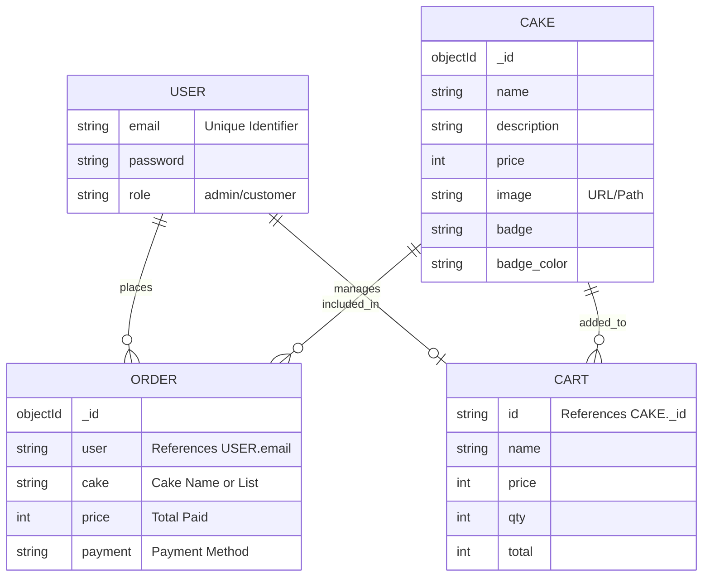

# Cake Shop Entity-Relationship (ER) Diagram

This diagram represents the data models used in the Cake Shop application (MongoDB Collections).

## Data Relationships

1. **User → Order (1:N)**: A single user can place multiple orders over time.
2. **Cake → Order (N:M)**: Logically, many cakes can be part of many orders. In this implementation, the order stores the cake names as a snapshot.
3. **User → Cart (1:1)**: Each active session user has one temporary cart stored in their session.
4. **Cake → Cart (1:N)**: Multiple cakes can be added to a single cart with specific quantities.
