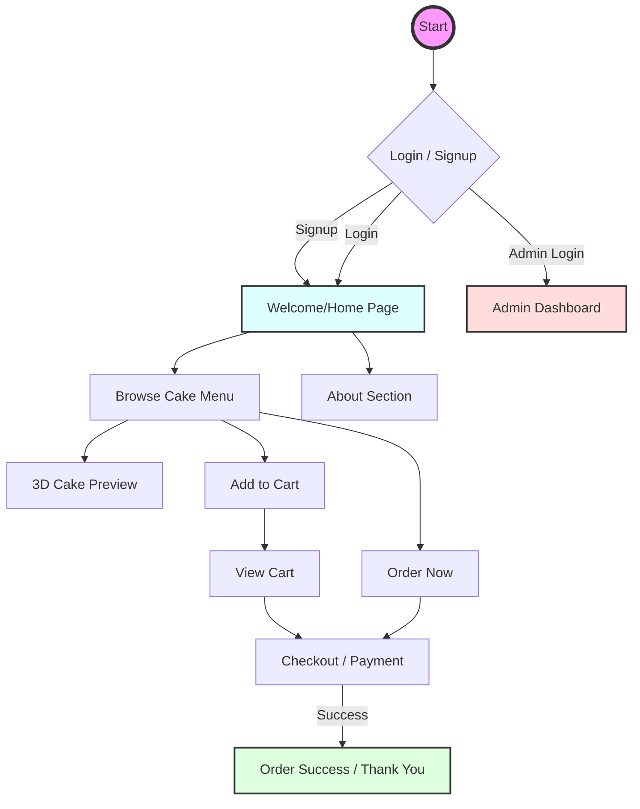

# Cake Shop Website Flowchart

This flowchart illustrates the user journey and page hierarchy of the Cake Shop website.

## Page Overview

| Page | Description |
| :--- | :--- |
| **Login/Signup** | User authentication module. |
| **Welcome** | The main landing page featuring a hero section and product catalog. |
| **3D Preview** | An interactive 3D model viewer for selected cakes. |
| **Cart** | Summary of items selected for purchase. |
| **Payment** | Secure checkout process. |
| **Success** | Confirmation of order placement. |
| **Admin** | Dashboard for managing inventory and orders (Admin only). |
